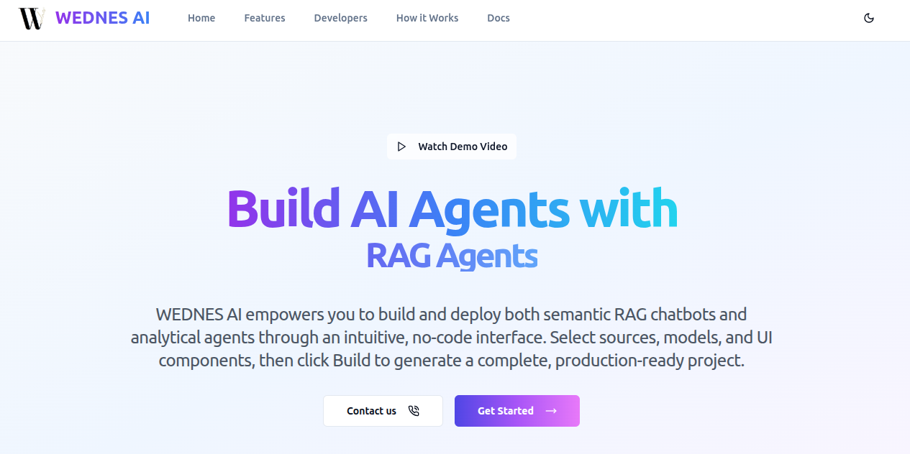
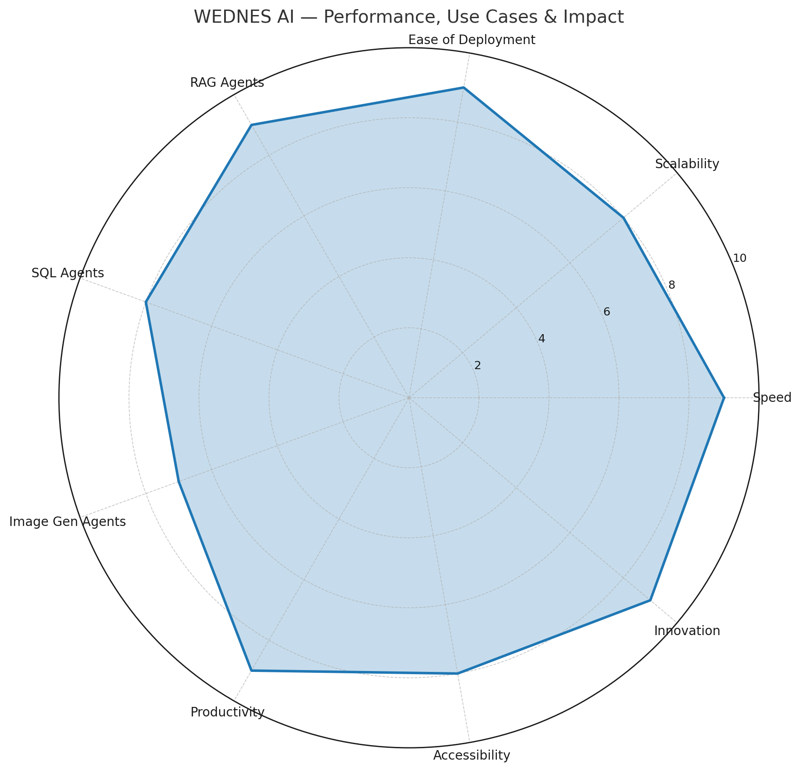

# WEDNES AI
### *No-Code AI Agent Builder Platform*


[](https://github.com/Prashanth-TechAI/WEDNES-AI-Frontend.git)
[](https://huggingface.co/prashanth970)
[](https://openai.com/chatgpt)

> **Build production-ready AI agents without writing a single line of code.**  
> WEDNES AI is a comprehensive backend platform that enables users to create, deploy, and manage intelligent **RAG (Retrieval-Augmented Generation)**, **SQL**, and **Image Generation** agents through a modular and API-first architecture.


<p align="center">
  
</p>

---

## Table of Contents
- [Installation & Setup](#️-installation--setup)
- [Features](#-features)
- [Platform Capabilities](#-platform-capabilities)
- [Tech Stack](#-tech-stack)
- [Agents Requirements](#agents-requirements)
  - [RAG Agent — End-to-End Setup](#rag-agent--end-to-end-setup)
  - [SQL/Data Agent — End-to-End Setup](#sqldata-agent--end-to-end-setup)
  - [Image Generation Agent — Simple Flow](#image-generation-agent--simple-flow)
- [Demo](#-demo)
- [Snapshot Checklists](#-snapshot-checklists-by-category)
- [Getting Help](#-getting-help)
- [Troubleshooting](#-troubleshooting)
- [Acknowledgments](#-acknowledgments)


## 🛠️ Installation & Setup

### Prerequisites
- Python 3.10 +
- pip package manager
- All Required Dependencies


### 1. Clone the Repository
```bash
git https://github.com/Prashanth-TechAI/WEDNES-AI-Backend.git
cd WEDNES_Backend
```


### 2. Create Virtual Environment

```bash
python -m venv venv

# On Windows
venv\Scripts\activate

# On macOS/Linux
source venv/bin/activate
```

### 3. Install Dependencies
```bash
pip install --upgrade pip
pip install -r requirements.txt

```

### 5. Run the Application
```bash
uvicorn main:app --reload
```
**Open API Documentation**

Global APIs → http://localhost:8000/docs

RAG Agent APIs → http://localhost:8000/rag/docs

SQL Agent APIs → http://localhost:8000/sql/docs

Image Agent APIs → http://localhost:8000/img/docs


##  Features

### **Core Platform Features**
- **Secure Authentication** - JWT-based auth with Google OAuth integration
- **User Management** - Profile management, API key vault, and activity tracking
- **Agent Dashboard** - Centralized control panel for all your AI agents
- **Real-time Preview** - Test your agents before deployment
- **One-Click Deploy** - Download ready-to-run Python applications
- **API Key Management** - Encrypted storage for all your AI provider keys

###  **Agent Building Capabilities**
- **RAG Agents** - Document-based question answering systems
- **SQL Agents** - Natural language to database query conversion
- **Visual Pipeline Builder** - Drag-and-drop interface for agent configuration
- **Multi-step Workflows** - Complex data processing pipelines
- **Responsive UI** - Works seamlessly across all devices

---


## 🎥 Demo

<p align="center">
  <!-- Use the BLOB URL, not the RAW URL -->
  <a href="https://github.com/Prashanth-TechAI/WEDNES-AI-Backend/blob/main/pubcontentlic/demo.mp4">
    
  </a>
</p>

<p align="center">
  <!-- This opens GitHub’s built-in player with controls -->
  <a href="https://github.com/Prashanth-TechAI/WEDNES-AI-Backend/blob/main/content/demo.mp4">
    ▶ Watch the demo (MP4)
  </a>
</p>


##  Platform Capabilities

###  **Supported Data Sources**
| Source Type | RAG Agents | SQL Agents | Description |
|-------------|------------|------------|-------------|
|  **PDF** | ✅ | ❌ | Document parsing and text extraction |
|  **CSV** | ✅ | ✅ | Structured data processing |
|  **Excel** | ✅ | ✅ | Spreadsheet analysis (.xlsx, .xls) |
|  **MongoDB** | ✅ | ❌ | NoSQL database integration |
|  **PostgreSQL** | ✅ | ✅ | Advanced relational database |
|  **MySQL** | ✅ | ✅ | Popular SQL database |
|  **SQLite** | ❌ | ✅ | Lightweight file-based database |

###  **AI/LLM Providers**
| Provider | Models Available | Use Cases |
|----------|------------------|-----------|
|  **OpenAI** | GPT-4, GPT-4 Turbo, GPT-3.5 | General purpose, high quality |
|  **Groq** | Llama 3.1, Llama 3.3 | Ultra-fast inference |
|  **Google Gemini** | Gemini 1.5 Flash, Gemini 2.0 | Multimodal capabilities |
|  **Anthropic Claude** | Claude 3.5 Haiku, Claude Sonnet | Reasoning and analysis |
|  **DeepSeek** | DeepSeek Chat, DeepSeek Coder | Code generation and chat |

###  **Vector Databases**
| Database | Type | Best For |
|----------|------|----------|
|  **Pinecone** | Managed | Production scale, serverless |
|  **Qdrant** | Self-hosted | High performance, local control |
|  **Milvus** | Open source | Large scale, enterprise |
|  **FAISS** | Local | Development, prototyping |
|  **Chroma** | Lightweight | Small to medium projects |

###  **UI Frameworks**
| Framework | Type | Features |
|-----------|------|----------|
|  **Streamlit** | Web app | Interactive widgets, charts |
|  **Gradio** | ML interface | Quick prototyping, sharing |

---


## 🛠️ Tech Stack

### ⚙️ **Backend Technologies**
| Technology | Purpose |
|------------|---------|
| **FastAPI** | Main web framework for APIs |
| **Python** | Core programming language |
| **SQLAlchemy** | ORM for PostgreSQL and relational DBs |
| **PostgreSQL** | Primary relational database |
| **Redis** | Cache + message broker for Celery |
| **Celery** | Background task and job scheduling |
| **Jinja2** | Template engine for agent code generation |
| **Pydantic** | Data validation and schema modeling |
| **python-dotenv** | Environment variable management |
| **Cryptography (Fernet)** | API key encryption |
| **bcrypt / passlib** | Secure password hashing |
| **JWT (python-jose)** | Token-based authentication |
| **smtplib (Gmail SMTP)** | Password reset & email service |
| **Uvicorn** | ASGI server to run FastAPI |

### 🧠 **AI & Agent-Specific Components**
| Component | Purpose |
|-----------|---------|
| **Groq API** | LLM inference & code generation |
| **OpenAI / Gemini / Claude / DeepSeek APIs** | Supported LLM providers |
| **Sentence-Transformers** | Embedding models (e.g., `all-MiniLM-L6-v2`) |
| **OpenAI Embeddings** | Alternative embedding provider |
| **Vector Databases** | FAISS, Milvus, Qdrant, Pinecone, ChromaDB |
| **Streamlit / Gradio** | Generated UI frameworks for agents |


## 📊 Platform Performance, Use Cases & Impact

<p align="center">
  
</p>

> This radar chart highlights **WEDNES AI’s strengths**:  
> High performance (speed, scalability, easy deployment)  
> Broad use cases (RAG, SQL, Image Generation agents)  
> Strong impact (productivity, accessibility, innovation)  


# AGENTS FLOWS


## RAG Agent — End-to-End Setup

| Step | What You Configure | Options (Examples) | Notes |
|-----:|--------------------|--------------------|------|
| 1 | **Name** | e.g., `Docs Helper`, `Finance Q&A` | Stored in the pipeline/session. |
| 2 | **Source (Data)** | **CSV**, **Excel**, **MongoDB**, **PostgreSQL**, **MySQL** | Choose where your knowledge lives. |
| 3 | **Embedding Model** | Sentence-Transformers (e.g., `all-MiniLM-L6-v2`), **OpenAI Embeddings** | Converts text to vectors for search. |
| 4 | **Vector DB / Index** | **Milvus**, **FAISS** | Example: 384-dim cosine for MiniLM. |
| 5 | **LLM Provider + Model + Key** | **OpenAI**, **Groq**, **Gemini**, **Claude**, **DeepSeek** | Pick a model from the menu; API keys are stored encrypted. |
| 6 | **System Prompt** | Custom instruction text | Guides the agent’s tone & behavior. |
| 7 | **UI** | **Streamlit** or **Gradio** | Final app auto-selects what’s installed. |
| 8 | **Build** | — | Uses Groq API to generate a single `main.py` plus `config.json`, `.env`, `requirements.txt`. |
| 9 | **Preview / Download** | **Preview** runs the UI; **Download** a zip | Quickly test, then export for deployment. |


## SQL/Data Agent — End-to-End Setup

| Step | What You Configure | Options (Examples) | Notes |
|-----:|--------------------|--------------------|------|
| 1 | **Name** | e.g., `Sales Insights`, `HR Dashboard` | Stored in the pipeline/session. |
| 2 | **Source (Data)** | **CSV**, **Excel**, **PostgreSQL**, **MySQL**, **SQLite** | Choose the database or file format. |
| 3 | **Framework (Analysis Layer)** | **PandasAI**, **LangChain SQL**, **Vanna (stub)** | PandasAI is integrated; Vanna is a future option. |
| 4 | **LLM Provider + Model + Key** | **OpenAI**, **Groq**, **Gemini**, **Claude**, **DeepSeek** | PandasAI supports switching providers; API keys are stored encrypted. |
| 5 | **System Prompt** | Default template (`prompt/default.j2`) or custom | Controls agent behavior and instructions. |
| 6 | **UI** | **Streamlit** or **Gradio** | The generated app auto-detects which UI is installed. |
| 7 | **Build** | — | Uses `sql_agent_builder` with combined skeleton (`main_embed.py`); Groq generates the final `main.py`. |
| 8 | **Preview / Download** | **Preview** runs the UI; **Download** gives a zip | Same flow as RAG agent. |


## Image Generation Agent — Simple Flow

| Step | What You Do | Notes |
|-----:|-------------|-------|
| 1 | **Click “Image Agent” button** | Launches the Streamlit UI directly. |
| 2 | **Enter Gemini API Key** | Required to enable image generation. |
| 3 | **Choose Input Method** | - Enter a text **prompt** to generate an image<br>- Or **upload an image** to edit/transform |
| 4 | **Generate / Edit Image** | The agent calls Gemini’s Vision API to produce results. |
| 5 | **Preview Output** | Images appear in the Streamlit interface. |
| 6 | **Download Results** | Save generated or edited images locally. |


## 📋 Snapshot Checklists (by Category)

### 🔹 Data Sources Available Today
- **RAG Agents** → CSV, Excel, MongoDB, PostgreSQL, MySQL  
- **SQL/Data Agents** → CSV, Excel, PostgreSQL, MySQL, SQLite  

---

### 🔹 Embeddings (RAG)
- **Sentence-Transformers** → e.g., `all-MiniLM-L6-v2`  
- **OpenAI Embeddings** → optional alternative  

---

### 🔹 Vector Databases (RAG)
- **Milvus** → open source, large-scale vector search  
- **FAISS** → local, fast prototyping  
- **Qdrant** → self-hosted, high-performance  
- **Pinecone** → managed, serverless, production-ready  

---

### 🔹 LLM Providers & Model Menus
- **OpenAI** → models like `gpt-4.1`, `gpt-4.1-mini`, `gpt-4o`  
- **Groq** → models like `llama-3.1-8b-instant`, `llama-3.3-70b-versatile`  
- **Google Gemini** → models like `gemini-1.5-flash`, `gemini-2.0-pro`  
- **Anthropic Claude** → models like `claude-3.5-haiku`, `claude-3.7-sonnet`  
- **DeepSeek** → models like `deepseek-v3`, `deepseek-r1`, `deepseek-coder`  

---

### 🔹 UI Frameworks
- **Streamlit** → full-featured web app with widgets  
- **Gradio** → lightweight ML interface for quick prototyping  

---

### 🔹 Codegen (the “Magic”)
- Uses **Groq’s** OpenAI-compatible endpoint  
- Requires **`GROQ_API_KEY`**  
- Generates **`main.py`**, `config.json`, `.env`, and `requirements.txt` automatically  

---

### 🔹 Other Tools Used
- **Celery / Redis** → background task processing  
- **Jinja2** → template-based code generation  
- **SQLAlchemy** → ORM for PostgreSQL  
- **Fernet** → API key encryption  
- **Gmail SMTP** → password reset emails  
- **dotenv** → environment variable management  
- **pydantic** → schema validation  


###  Getting Help

- 📖 Check the frontend [repository here](https://github.com/Prashanth-TechAI/WEDNES-AI-Backend.git)  
- 🐛 Report bugs or request features via [GitHub Issues](https://github.com/Prashanth-TechAI/WEDNES-AI-Backend.git/issues)  
- 💬 Connect with the developer on [LinkedIn](https://www.linkedin.com/in/gummala-prashanth-1a34a3273)  
- 📧 Reach out via email: **gummalaprashanth509@gmail.com**  
---

## 👥 Team

<p align="center">
  <a href="https://www.linkedin.com/in/gummala-prashanth-1a34a3273" style="text-decoration:none;">
    
    <br/>
    <sub><b>GUMMALA PRASHANTH</b></sub>
  </a>
  <br/>
  <sub>Founder & Backend Engineer</sub>
  <br/>
</p>

<p align="center">
  <a href="#" style="text-decoration:none;">
    
    <br/>
    <sub><b>GODITI BHASKAR</b></sub>
  </a>
  <br/>
  <sub>Co-Developer</sub>
</p>


## Troubleshooting

**1. "API Key not found" error**  
- Ensure your `.env` file contains valid keys (e.g., `GROQ_API_KEY`, `OPENAI_API_KEY`, `GEMINI_API_KEY`, etc.)  
- Restart the FastAPI server after adding or changing keys  
- Verify the key is active and has enough credits/quota  

**2. Database connection fails**  
- Double-check your `DATABASE_URL` in `.env`  
- Ensure PostgreSQL/MySQL/SQLite/MongoDB is running and accessible  
- For cloud DBs, verify the backend host/IP is whitelisted  

**3. File upload fails**  
- Default file size limit is **10MB**  
- Supported formats: **CSV**, **Excel (.xls, .xlsx)**, **PDF (for RAG)**  
- Ensure the file is not corrupted and follows the expected schema  

**4. Queries return empty or incorrect responses**  
- Provide a more detailed **system prompt** in API requests  
- Make sure the uploaded dataset contains the columns being queried  
- If using RAG, verify embeddings and vector DB were created successfully  

**5. API Docs not loading**  
- Make sure the backend is running with `uvicorn main:app --reload`  
- Access:  
  - Global APIs → [http://localhost:8000/docs](http://localhost:8000/docs)  
  - RAG Agent APIs → [http://localhost:8000/rag/docs](http://localhost:8000/rag/docs)  
  - SQL Agent APIs → [http://localhost:8000/sql/docs](http://localhost:8000/sql/docs)  
  - Image Agent APIs → [http://localhost:8000/img/docs](http://localhost:8000/img/docs)  

---

## Acknowledgments

- [FastAPI](https://fastapi.tiangolo.com/) — lightning-fast Python web framework  
- [SQLAlchemy](https://www.sqlalchemy.org/) — ORM for database management  
- [Celery](https://docs.celeryq.dev/en/stable/) + [Redis](https://redis.io/) — background task processing  
- [Pydantic](https://docs.pydantic.dev/) — data validation  
- [Jinja2](https://jinja.palletsprojects.com/) — template rendering  
- [Groq](https://groq.com/), [OpenAI](https://openai.com/), [Anthropic](https://www.anthropic.com/), [Google Gemini](https://deepmind.google/) — LLM providers  

- The open-source community ❤️  

<div align="center">
  <strong>⭐ If this project helped you, please give it a star! ⭐</strong>
</div>